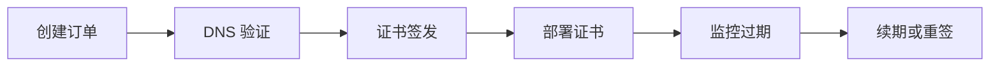

# 自动化管理

EveryoneTrust SSL 的自动化能力可以减少重复操作，并降低证书过期风险。

## 自动化范围

| 范围 | 目标 |
| --- | --- |
| DNS 授权 | 自动创建域名验证记录。 |
| 证书监控 | 监控过期时间、签发者和证书健康状态。 |
| 部署流水线 | 将续期后的证书推送到服务器或网关。 |
| 通知提醒 | 在证书进入风险期前通知团队。 |

::: tip
即使暂时不做全自动部署，也建议先开启监控。可见性通常能避免大多数紧急续期。
:::

## 推荐流水线

::: warning
自动部署后要确保目标服务安全重载。证书复制到服务器并不代表服务已经真正启用新证书。
:::
